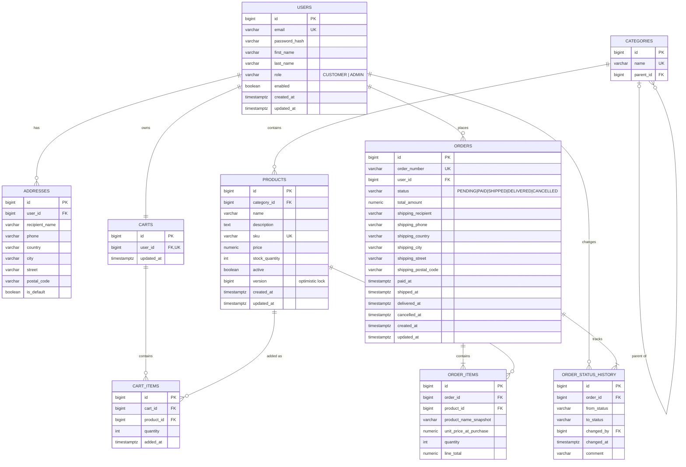

```mermaid
erDiagram
    USERS ||--o{ ADDRESSES : has
    USERS ||--|| CARTS : owns
    USERS ||--o{ ORDERS : places
    USERS ||--o{ ORDER_STATUS_HISTORY : changes
    CATEGORIES ||--o{ PRODUCTS : contains
    CATEGORIES |o--o{ CATEGORIES : "parent of"
    CARTS ||--o{ CART_ITEMS : contains
    PRODUCTS ||--o{ CART_ITEMS : "added as"
    ORDERS ||--|{ ORDER_ITEMS : contains
    PRODUCTS ||--o{ ORDER_ITEMS : "sold as"
    ORDERS ||--|{ ORDER_STATUS_HISTORY : tracks

    USERS {
        bigint id PK
        varchar email UK
        varchar password_hash
        varchar first_name
        varchar last_name
        varchar role "CUSTOMER | ADMIN"
        boolean enabled
        timestamptz created_at
        timestamptz updated_at
    }
    ADDRESSES {
        bigint id PK
        bigint user_id FK
        varchar recipient_name
        varchar phone
        varchar country
        varchar city
        varchar street
        varchar postal_code
        boolean is_default
    }
    CATEGORIES {
        bigint id PK
        varchar name UK
        bigint parent_id FK
    }
    PRODUCTS {
        bigint id PK
        bigint category_id FK
        varchar name
        text description
        varchar sku UK
        numeric price
        int stock_quantity
        boolean active
        bigint version "optimistic lock"
        timestamptz created_at
        timestamptz updated_at
    }
    CARTS {
        bigint id PK
        bigint user_id FK, UK
        timestamptz updated_at
    }
    CART_ITEMS {
        bigint id PK
        bigint cart_id FK
        bigint product_id FK
        int quantity
        timestamptz added_at
    }
    ORDERS {
        bigint id PK
        varchar order_number UK
        bigint user_id FK
        varchar status "PENDING|PAID|SHIPPED|DELIVERED|CANCELLED"
        numeric total_amount
        varchar shipping_recipient
        varchar shipping_phone
        varchar shipping_country
        varchar shipping_city
        varchar shipping_street
        varchar shipping_postal_code
        timestamptz paid_at
        timestamptz shipped_at
        timestamptz delivered_at
        timestamptz cancelled_at
        timestamptz created_at
        timestamptz updated_at
    }
    ORDER_ITEMS {
        bigint id PK
        bigint order_id FK
        bigint product_id FK
        varchar product_name_snapshot
        numeric unit_price_at_purchase
        int quantity
        numeric line_total
    }
    ORDER_STATUS_HISTORY {
        bigint id PK
        bigint order_id FK
        varchar from_status
        varchar to_status
        bigint changed_by FK
        timestamptz changed_at
        varchar comment
    }
```
